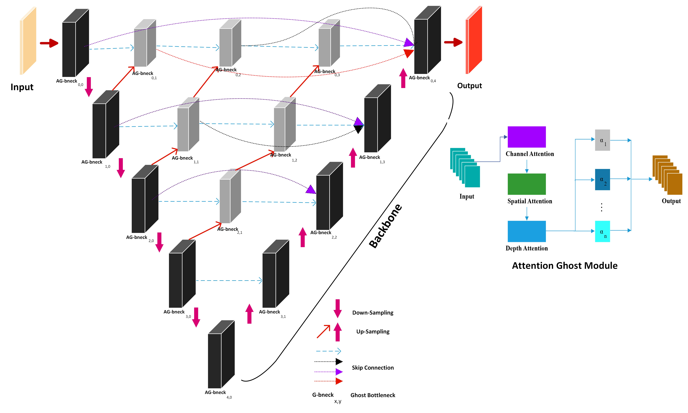
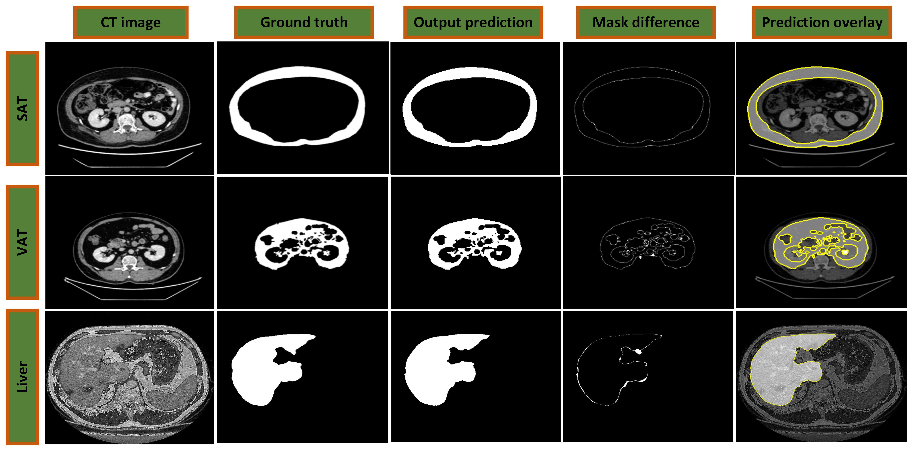

# Attention Ghost UNet++: Segmentation of Adipose Tissue and Liver in CT Images

## Overview

This repository contains the implementation of **Attention GhostUNet++**, a novel architecture for medical image segmentation. The model leverages advanced attention mechanisms and ghost bottleneck structures for efficient feature extraction and precise segmentation.

### Model Architecture


The architecture incorporates:
- **Attention Ghost Modules**: Combining channel, spatial, and depth attention for enhanced feature learning.
- **Ghost Bottlenecks**: Efficient feature extraction using lightweight operations.
- **Skip Connections**: Preserving spatial information across layers.

### Results


The above results demonstrate the segmentation performance of the model on **SAT**, **VAT**, and **Liver** datasets. Metrics such as mask difference and overlay predictions highlight its accuracy and robustness.

---

## Notebooks

The following Jupyter notebooks are included:

1. **`Liver_Segm_Attention GhostUNeT++.ipynb`**: Demonstrates the segmentation pipeline for liver CT images.
2. **`SAT Attention GhostUNeT++.ipynb`**: Implements SAT segmentation.
3. **`VAT_Segm_Attention GhostUNeT++.ipynb`**: Implements VAT segmentation.

### Steps to Run the Notebooks

1. Clone this repository and navigate to the directory:
   ```bash
   git clone https://github.com/MansoorHayat777/Attention-GhostUNetPlusPlus/
   ```

2. Open the desired notebook and execute cells in sequence:
   ```bash
   jupyter notebook
   ```

---

## Pre-trained Model

The pre-trained model will be made available after the associated research paper is published. Currently, the paper is under review.

---

### Citation

Will be added later

